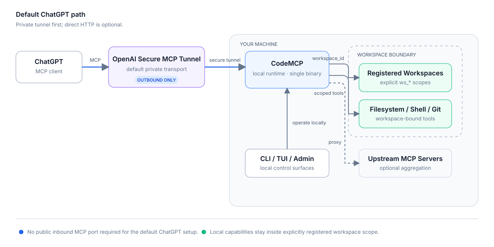

<div align="center">

# CodeMCP

**A secure, workspace-bound bridge between ChatGPT and your machine.**

Single Go binary · OpenAI Secure MCP Tunnel · Linux, macOS, and Windows

[](https://github.com/mewisme/codemcp/releases/latest)
[](https://github.com/mewisme/codemcp/actions/workflows/ci.yml)
[](go.mod)
[](LICENSE)

[Get started](docs/getting-started.md) · [Connect ChatGPT](docs/openai-chatgpt.md) · [Command Center](docs/tui.md) · [Security](docs/security.md) · [Documentation](docs/README.md)

</div>

`CodeMCP` lets ChatGPT work with local projects through explicitly registered workspaces. The default setup uses **OpenAI Secure MCP Tunnel**, so the runtime can stay private without exposing an inbound MCP port to the public internet.

## Overview

<p align="center">
  
</p>

The main path is intentionally small: ChatGPT reaches the local runtime through the Secure MCP Tunnel, then `CodeMCP` applies workspace scope before filesystem, shell, Git, process, or Upstream work happens.

### Why CodeMCP

- **Private by default for ChatGPT** — the Secure MCP Tunnel is outbound-only from your machine; public MCP ingress is not required.
- **Workspace-bound access** — filesystem, shell, Git, process, context, memory, rules, skills, and checkpoints operate against explicit `ws_*` workspace targets.
- **Local control stays local** — use the CLI, full-screen TUI, or embedded Admin UI to inspect and operate the runtime.
- **Upstream aggregation** — optionally expose tools from remote MCP endpoints through the same runtime.
- **One cross-platform binary** — native releases for Linux, macOS, and Windows on amd64 and arm64, with managed background-service support.

## Install

For most developer machines, use the managed direct installer. It keeps CodeMCP under your user account and gives `cm upgrade` a transactional, rollback-capable install layout.

### Linux / macOS

```bash
curl -fsSL get.mewis.me/codemcp.sh | sh
```

### Windows

```powershell
irm https://get.mewis.me/codemcp.ps1 | iex
```

Prefer a normal setup executable? Download the latest [Windows amd64 setup](https://github.com/mewisme/codemcp/releases/latest/download/codemcp_windows_amd64_setup.exe) or [Windows arm64 setup](https://github.com/mewisme/codemcp/releases/latest/download/codemcp_windows_arm64_setup.exe). Both bootstrap the same managed direct layout as the PowerShell installer.

### Package managers

```bash
brew tap mewisme/mew
brew install --cask codemcp
```

```powershell
scoop bucket add mew https://github.com/mewisme/scoop-mew
scoop install mew/codemcp
```

Debian and RPM release packages are also available for Linux amd64/arm64. Package-manager installs remain package-manager-owned; see [Getting started](docs/getting-started.md#native-linux-packages) for download names and ownership details.

The installed executable is always `cm`.

## 5-minute setup

### 1. Initialize

```bash
cm init
```

### 2. Register the project ChatGPT may work with

```bash
cm workspace register ~/projects/my-project
```

The command returns a stable `ws_*` workspace ID. Register only roots you intentionally want the runtime to reach.

### 3. Configure the Secure MCP Tunnel

Create a tunnel and a restricted runtime API key in OpenAI Platform, then configure them locally:

```bash
cm tunnel configure \
  --enabled \
  --id tunnel_... \
  --api-key 'sk-...'
```

The runtime key should have **Tunnels Read + Use**. It is not an OpenAI Admin API key and is not used to call a language model.

### 4. Start the managed runtime

```bash
cm up
```

Verify locally:

```bash
cm status
cm tunnel status
```

### 5. Connect ChatGPT

Enable Developer Mode in ChatGPT, create a custom app using **Tunnel**, select the same tunnel, and **Scan Tools**.

The complete Platform permissions and ChatGPT setup flow is in [Connect ChatGPT with OpenAI Secure MCP Tunnel](docs/openai-chatgpt.md).

## Operate it

For interactive administration:

```bash
cm tui
```

For scripts and automation, use the normal CLI:

```bash
cm status
cm workspace list
cm logs -f
cm config verify
```

Use `cm <command> --help` for the live command surface. The exhaustive command inventory lives in the [CLI reference](docs/cli-reference.md), not in this README.

## Other MCP clients

The tunnel-first flow above is the default ChatGPT setup. Generic local MCP clients can instead use dedicated `stdio` or local Streamable HTTP transports:

```bash
cm mcp stdio --workspace ~/projects/my-project
cm mcp http --workspace ws_...
```

See [MCP clients and Upstreams](docs/mcp.md).

## Security model

`CodeMCP` provides an application-level workspace and control-plane boundary, not a kernel sandbox. Paths are canonicalized, symlink escapes are rejected, trusted control-plane mutations are separated from ordinary workspace operations, and sensitive managed credentials are not stored as plaintext structured config.

If you need isolation from deliberately hostile native code running as the same OS user, use an OS sandbox, container/VM, or separate operating-system identity.

Read [Security](docs/security.md) before widening network exposure or filesystem access.

## Documentation

| Goal | Read |
| --- | --- |
| Install and connect ChatGPT | [Getting started](docs/getting-started.md) |
| Configure OpenAI Secure MCP Tunnel and the ChatGPT app | [OpenAI + ChatGPT](docs/openai-chatgpt.md) |
| Understand workspace scope and containers | [Workspaces](docs/workspaces.md) |
| Run, stop, inspect, update, and read logs | [Runtime and operations](docs/runtime.md) |
| Use the full-screen terminal UI | [TUI Command Center](docs/tui.md) |
| Configure auth, exposure, storage, and runtime settings | [Configuration](docs/configuration.md) |
| Configure LLM providers, models, credentials, and shared Explain | [LLM providers](docs/llm.md) |
| Connect generic MCP clients or configure Upstreams | [MCP clients and Upstreams](docs/mcp.md) |
| Look up commands and flags | [CLI reference](docs/cli-reference.md) |
| Understand trust boundaries | [Security](docs/security.md) |
| Diagnose common failures | [Troubleshooting](docs/troubleshooting.md) |
| Build and contribute | [Development](docs/development.md) |

See the [documentation index](docs/README.md) for the recommended reading paths.

## Development

Source builds require Go 1.27+, Node.js 24+, and pnpm 11+.

```bash
./scripts/check.sh
```

See [Development](docs/development.md) for the complete verification, CI, and release workflow, and [CONTRIBUTING.md](CONTRIBUTING.md) for contribution expectations.

## License

MIT License. Copyright (c) 2026 Mew.
