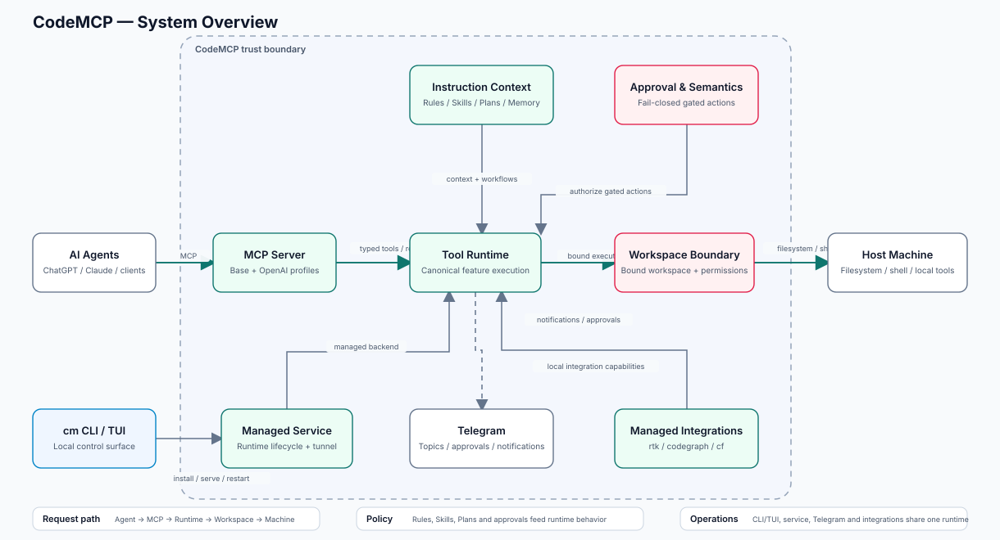

<div align="center">

# CodeMCP

**A secure, workspace-bound MCP bridge connecting ChatGPT, Claude, and other AI agents to your machine.**

Single Go binary · OpenAI Secure MCP Tunnel · Linux, macOS, and Windows

[](https://github.com/mewisme/codemcp/releases/latest)
[](https://github.com/mewisme/codemcp/actions/workflows/ci.yml)
[](go.mod)
[](LICENSE)

[Get started](docs/getting-started.md) · [MCP profiles](docs/mcp.md) · [Security](docs/security.md) · [Documentation](docs/README.md)

</div>

CodeMCP runs locally and gives supported AI clients controlled access to explicitly registered projects. For ChatGPT, the primary path is **OpenAI Secure MCP Tunnel**: the local runtime makes an outbound connection to OpenAI, so the MCP server does not need a public inbound endpoint. Generic MCP clients can use the same runtime through local stdio or Streamable HTTP.

## Overview

<p align="center">
  <picture>
    <source media="(prefers-color-scheme: dark)" srcset="docs/architecture/overview-dark.svg">
    <source media="(prefers-color-scheme: light)" srcset="docs/architecture/overview-light.svg">
    
  </picture>
</p>

One runtime owns canonical feature execution. Workspace scope and permissions constrain host access, while instruction context, approvals, local control surfaces, Telegram, and managed integrations feed the same runtime. MCP profiles only change the client-facing projection:

1. **OpenAI profile** — used by OpenAI Secure MCP Tunnel and available to direct HTTP clients with `--profile openai`.
2. **Base profile** — standards-oriented generic MCP projection and the default for direct local MCP transports.

See [MCP profiles and transports](docs/mcp.md).

### Why CodeMCP

- **Private OpenAI path** — Secure MCP Tunnel keeps the default ChatGPT connection outbound-only from your machine.
- **Workspace-bound execution** — filesystem, shell, Git, process, context, memory, rules, skills, plans, and checkpoints operate against registered `ws_*` scopes.
- **Local authority** — approvals, control guards, secrets, and runtime policy remain local even when the client projection changes.
- **Multiple operator surfaces** — CLI, TUI, Browser Admin, and Telegram use the same application services.
- **Extensible runtime** — optional RTK, CodeGraph, TypeSafe/SystemOne, LLM providers, and upstream MCP servers extend the same runtime.

## Install

The installed command is always **`cm`**. Pick one installation owner and keep using that owner for upgrades.

### Managed direct install

Best when you want a per-user installation managed by CodeMCP itself. `cm upgrade` verifies, stages, activates, and can roll back managed-direct releases.

**Linux / macOS**

```bash
curl -fsSL get.mewis.me/codemcp.sh | sh
```

**Windows PowerShell**

```powershell
irm https://get.mewis.me/codemcp.ps1 | iex
```

**Windows setup executables**

- [Windows amd64 setup](https://github.com/mewisme/codemcp/releases/latest/download/codemcp_windows_amd64_setup.exe)

The setup executable bootstraps the same managed-direct layout as the PowerShell installer.

### Homebrew

```bash
brew tap mewisme/mew
brew install --cask codemcp
```

Homebrew owns upgrades for this installation.

### Scoop

```powershell
scoop bucket add mew https://github.com/mewisme/scoop-mew
scoop install mew/codemcp
```

Scoop owns upgrades for this installation.

### Debian packages

| Architecture | Package |
| --- | --- |
| amd64 | [`codemcp_linux_amd64.deb`](https://github.com/mewisme/codemcp/releases/latest/download/codemcp_linux_amd64.deb) |
| arm64 | [`codemcp_linux_arm64.deb`](https://github.com/mewisme/codemcp/releases/latest/download/codemcp_linux_arm64.deb) |

```bash
sudo apt install ./codemcp_linux_amd64.deb
```

Use the `arm64` package on ARM64. Debian owns upgrades after package installation.

### RPM packages

| Architecture | Package |
| --- | --- |
| amd64 | [`codemcp_linux_amd64.rpm`](https://github.com/mewisme/codemcp/releases/latest/download/codemcp_linux_amd64.rpm) |
| arm64 | [`codemcp_linux_arm64.rpm`](https://github.com/mewisme/codemcp/releases/latest/download/codemcp_linux_arm64.rpm) |

```bash
sudo dnf install ./codemcp_linux_amd64.rpm
```

Use the `arm64` package on ARM64. RPM/DNF owns upgrades after package installation.

### Manual release archives

Release asset filenames are stable; the Git tag carries the release version. Supported release targets are Linux x64/ARM64, macOS x64, and Windows x64.

| Platform | Architecture | Archive |
| --- | --- | --- |
| Linux | amd64 / x64 | [`codemcp_linux_amd64.tar.gz`](https://github.com/mewisme/codemcp/releases/latest/download/codemcp_linux_amd64.tar.gz) |
| Linux | arm64 | [`codemcp_linux_arm64.tar.gz`](https://github.com/mewisme/codemcp/releases/latest/download/codemcp_linux_arm64.tar.gz) |
| macOS | amd64 / x64 | [`codemcp_darwin_amd64.tar.gz`](https://github.com/mewisme/codemcp/releases/latest/download/codemcp_darwin_amd64.tar.gz) |
| Windows | amd64 / x64 | [`codemcp_windows_amd64.zip`](https://github.com/mewisme/codemcp/releases/latest/download/codemcp_windows_amd64.zip) |

For an exact version, pin the tag while keeping the stable filename:

```text
https://github.com/mewisme/codemcp/releases/download/vX.Y.Z/codemcp_linux_amd64.tar.gz
```

Release executable/package/setup assets are covered by `codemcp_checksums.txt`; its Sigstore bundle is `codemcp_checksums.txt.sigstore.json`.

## 5-minute OpenAI setup

Create the tunnel in [OpenAI Platform → Tunnels](https://platform.openai.com/settings/organization/tunnels), then use its `tunnel_...` ID below.

```bash
cm init
cm workspace register ~/projects/my-project
cm tunnel configure --enabled --id tunnel_...
cm tunnel key set
cm up
cm status
cm tunnel status
```

Use an OpenAI runtime key with **Tunnels Read + Use**. It is not an OpenAI Admin API key.

In ChatGPT developer mode, create a developer-mode app/plugin using **Tunnel**, select the same tunnel, scan tools, review the discovered surface, and enable it.

OpenAI's current Secure MCP Tunnel documentation is the source of truth for Platform permissions, workspace associations, and ChatGPT UI details: <https://developers.openai.com/api/docs/guides/secure-mcp-tunnels>.

## Generic MCP clients

The Base profile is the default for direct local transports:

```bash
cm mcp stdio --workspace ~/projects/my-project
cm mcp http --workspace ws_...
```

A direct HTTP client can request the OpenAI projection explicitly:

```bash
cm mcp http --profile openai --workspace ws_...
```

Profiles do not bypass CodeMCP authentication, workspace scope, control guards, or approvals. See [MCP profiles and transports](docs/mcp.md).

## Operate CodeMCP

```bash
cm status
cm logs -f
cm config verify
cm workspace list
cm tui
```

Use `cm <command> --help` for the installed binary's exact command and flag surface.

## Security model

CodeMCP is an application-level workspace and control boundary, not a kernel sandbox. It canonicalizes workspace roots, uses root-anchored filesystem operations for sensitive paths, rejects unsafe symlink escapes, separates control-plane mutations from ordinary workspace work, and stores managed credentials outside normal plaintext structured config.

For isolation from hostile native code running as the same OS user, use an OS sandbox, container/VM, or separate operating-system identity.

Read [Security](docs/security.md) before widening filesystem or network access.

## Documentation

| Goal | Guide |
| --- | --- |
| Install and connect ChatGPT | [Getting started](docs/getting-started.md) |
| Understand OpenAI and Base MCP profiles | [MCP profiles and transports](docs/mcp.md) |
| Scope projects and additional roots | [Workspaces](docs/workspaces.md) |
| Manage workspace/global Agent Skills and GitHub-backed skills | [Skills](docs/skills.md) |
| Run, inspect, update, and use operator UIs | [Operations](docs/operations.md) |
| Configure settings, auth, and secrets | [Configuration](docs/configuration.md) |
| Configure RTK, CodeGraph, TypeSafe, LLM, and Telegram | [Integrations](docs/integrations.md) |
| Understand trust boundaries and privacy | [Security](docs/security.md) |
| Diagnose failures | [Troubleshooting](docs/troubleshooting.md) |
| Build, test, and contribute | [Development](docs/development.md) |

See the [documentation index](docs/README.md) for suggested reading paths.

## Development

```bash
make bootstrap
make check
make test
```

See [Development](docs/development.md) and [CONTRIBUTING.md](CONTRIBUTING.md).

## License

[MIT](LICENSE)
